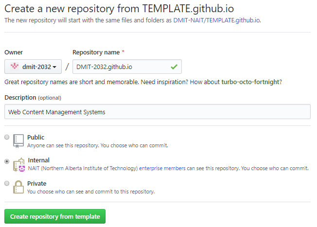

# DMIT-0001 - Name_of_Course

> A program of the [Northern Alberta Institute of Technology](http://nait.ca)

----

## Getting Started

The DMIT-NAIT organization has a [Template](https://github.com/DMIT-NAIT/TEMPLATE.github.io) that you can use to create the GitHub Web Pages site for your organization. It uses the [VuePress](https://vuepress.vuejs.org/)-based static site generator.

1. Click the green **Use this Template** button () above.
2. Fill out the form for creating your new repository. Name it based on this pattern (replacing *YourOrg* with your organization's name): `YourOrg.github.io`
    
3. Follow the instructions in the [TODO](about/todo.md) document for customizing your site.
